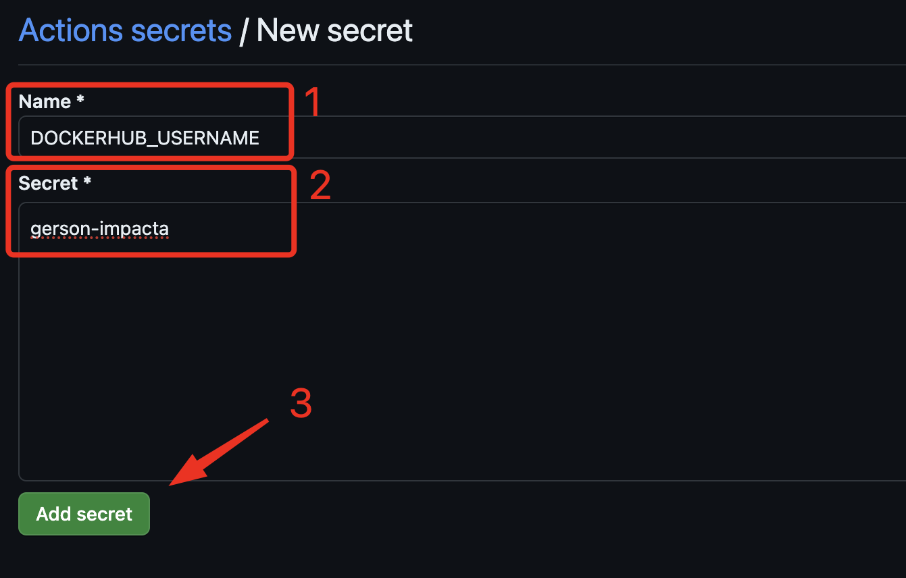
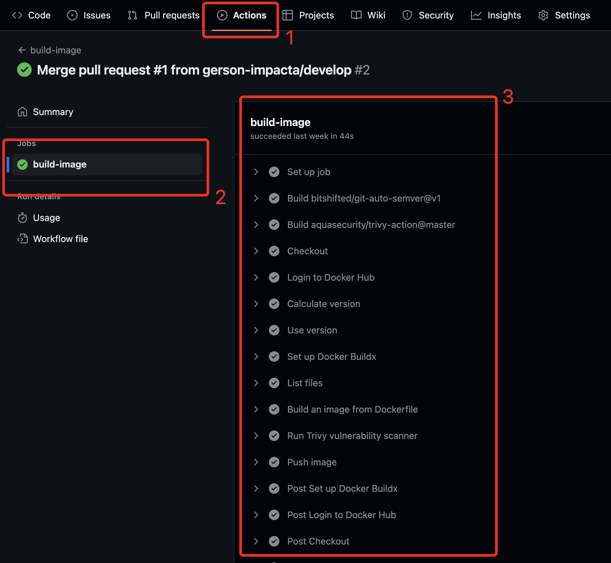

## Aula 2 - Container Technologies

### Exercicio 1 - Automatizando o processo de build

Criar uma pipeline utilizando github actions, utilizando versionamento [semântico](https://semver.org/) de forma automatizada, build da imagem, scan de vulnerabilidades e push para o dockerhub.


1. Crie o repositório no github com nome: container-technologies

2. Configure as secrets do seu dockerhub no github.  
Acesse as configurações do repositório, clique em `Settings`:


3. Em Security, clique em `Secrets and variables`, logo em seguida clique em `Actions`:


4. Clique na aba `Secrets`e clique em `New repository secret`:


5. Em `Name` coloque o nome da SECRET e em `Secret` insira o valor, logo em seguida clique em `Add secret`:



Faça o mesmo processo para as duas secrets:  
`DOCKERHUB_USERNAME` - Insira o username do dockerhub  
`DOCKERHUB_TOKEN` - Insira a senha do dockerhub  

É necessário para realizar o push da imagem no repositório do dockerhub.

6. Neste repositório iremos criar o workflow utilizando github actions, crie os diretórios `.github/workflows` executando o comando abaixo:

```shell
mkdir -p .github/workflows
```
7. Crie o arquivo onde iremos criar os nossos workflows

```shell

touch .github/workflows/01-build-image.yaml
```
8. A estrutura deve ficar da seguinte forma:
```shell
.
└── .github
    └── workflows
        └── 01-build-image.yaml
```
9. No arquivo `01-build-image.yaml` iremos configurar os nossos steps do nosso workflow

Insira o conteúdo no arquivo:

```github-actions
name: build-image

on:
  push:
    branches:
      - 'main'
      - 'develop'

jobs:
  build-image:
    runs-on: ubuntu-latest
    defaults:
      run:
        working-directory: app
    steps:
      - name: Checkout
        uses: actions/checkout@v4

      - name: Login to Docker Hub
        uses: docker/login-action@v3
        with:
          username: ${{ secrets.DOCKERHUB_USERNAME }}
          password: ${{ secrets.DOCKERHUB_TOKEN }}

      - name: Calculate version
        id: calculate-version
        uses: bitshifted/git-auto-semver@v1

        # https://github.com/marketplace/actions/git-automatic-semantic-versioning
      - name: Use version
        run: echo "Calculated version:v${{ steps.calculate-version.outputs.version-string }}"

      - name: Set up Docker Buildx
        uses: docker/setup-buildx-action@v3

      - name: List files
        run: ls -lha

      - name: Build an image from Dockerfile
        env:
          DOCKER_BUILDKIT: 1
        run: |
          docker build -t ${{ secrets.DOCKERHUB_USERNAME }}/container-technologies:v${{ steps.calculate-version.outputs.version-string }} .

      - name: Run Trivy vulnerability scanner
        uses: aquasecurity/trivy-action@master
        with:
          image-ref: '${{ secrets.DOCKERHUB_USERNAME }}/container-technologies:v${{ steps.calculate-version.outputs.version-string }}'
          format: 'table'
          exit-code: '1'
          ignore-unfixed: true
          vuln-type: 'os,library'
          severity: 'CRITICAL,HIGH'

      - name: Push image
        run: |
          docker image push ${{ secrets.DOCKERHUB_USERNAME }}/container-technologies:v${{ steps.calculate-version.outputs.version-string }}

      - name: Open Pull Request
        uses: devops-infra/action-pull-request@v0.5.5
        with:
          github_token: ${{ secrets.GITHUB_TOKEN }}
          source_branch: develop
          target_branch: main
          title: Automatic Pull Request
          body: "This is an automatic pull request from the develop branch."
          labels: |
            - enhancement
            - auto-pr
          draft: false
          allow_no_diff: false
```
10. Na raiz do projeto crie o diretório `app`:

Neste diretório coloque o arquivo app.gz

11. Crie o arquivo `Dockerfile` e coloque o conteúdo:

```Dockerfile
FROM nginx:alpine

ADD app.gz /usr/share/nginx/html/

CMD ["nginx", "-g", "daemon off;"]
```
12. Commitando os arquivos adicionados

```shell
git add .
```
```shell
git commmit -m "Criação do workflow"
```
```shell
git push origin
```
13. Acompanhe a execução do workflow, no repositório clique em `Actions` > `build-image` e acompanhe o workflow.



### Entregável

Anexe o link do repositório do github actions no Classroom.
Exemplo: https://github.com/<user>/container-technologies/actions