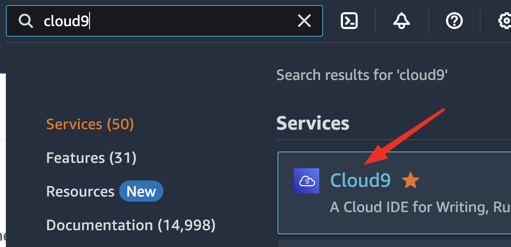
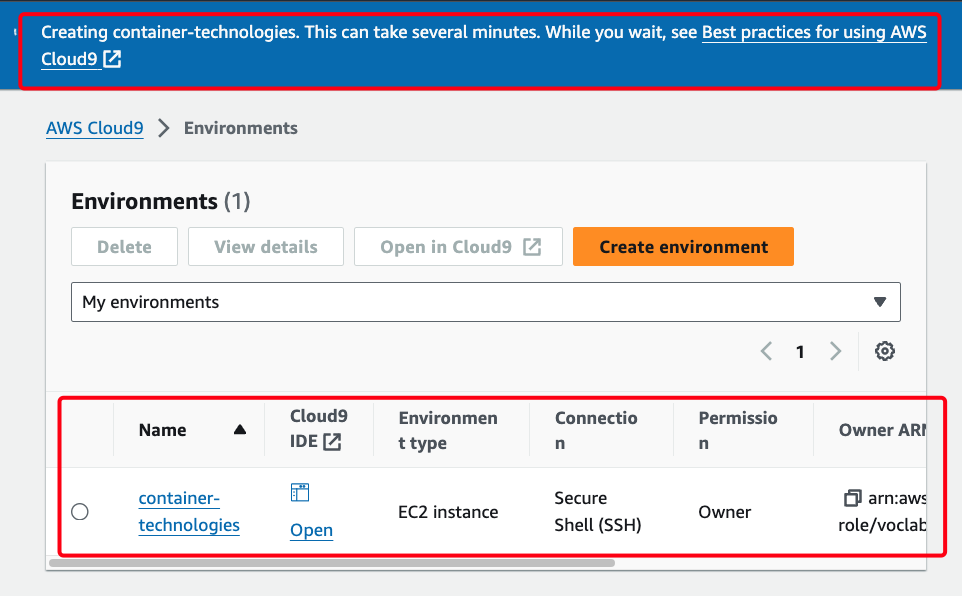
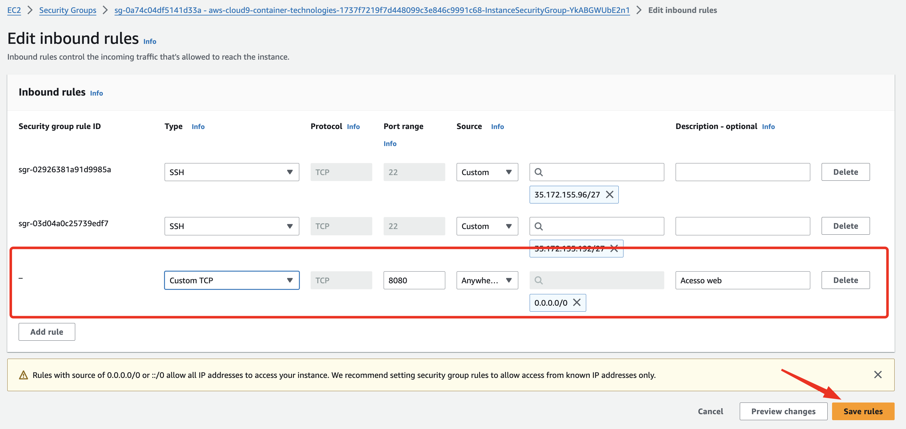
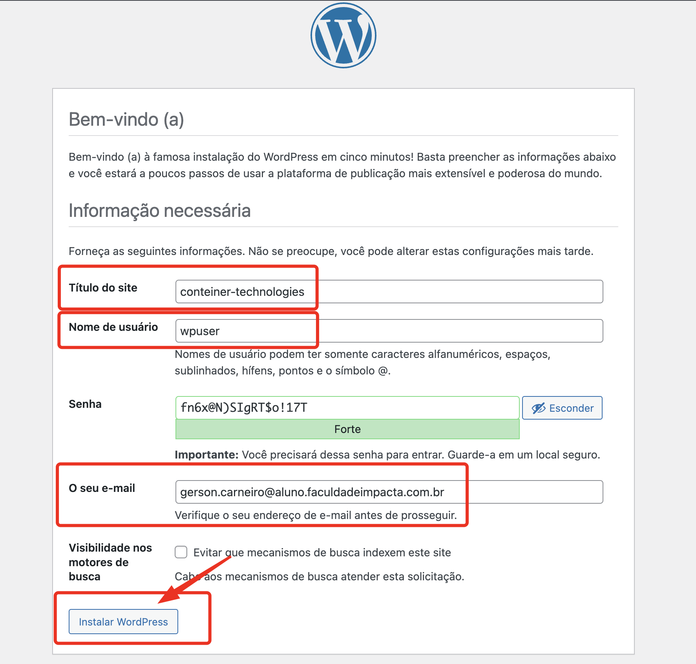
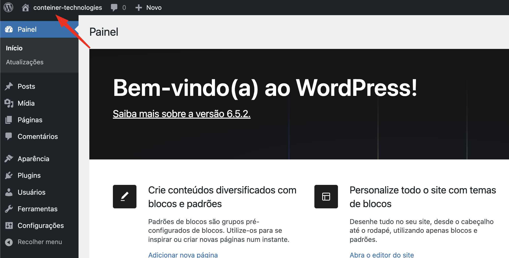

## Aula 3 - Container Technologies

### Preparando o ambiente no Cloud9

1. Criando o ambiente no Cloud9

Vá até serviços e pesquise por `Cloud9`



2. Em Cloud9 crie em `Create environment`:


3. Preencha os campos conforme as instruções abaixo:

- **Details:**  
**Name:** container-technologies  
**Environment type:** New EC2 instance  

- **New EC2 instance:**  
Selecione **Instance Type:** t3.small (2GiB RAM + 2vCPU)  
**Plataform:** Ubuntu Server 22.04 LTS  

- **Network settings**  
Selecione: **Secure Shell (SSH)**


4. E por último clique em **Create**


5. Aguarde a criação do ambiente



6. Enquanto cria o ambiente, vá no serviço EC2:


7. Selecione a instância criada `aws-cloud9-container-technologies-<ID/>`:
- Ao selecionar a instância, desça até a final da página e clique na aba **Security** e depois em  **Security Groups** clique no Segurity Group da instância.


8. No Security Group clique em **Edit inbound rules:**


9. Clique em **Save rules**, para salvar a regra criada



10. Vá novamente até o **Cloud9**, e clique em **Open**:


11. Conhecendo o **Cloud9**:


12. Clonando o repositório da aula

No terminal do Cloud9, execute o comando abaixo:

```shell
git clone https://github.com/gersontpc/container-technologies.git
```

### Exercicio 3 - docker compose (Wordpress)

Após clonar o repositório, iremos acessar o diretório 

1. Acesse o diretório aula3:
```shell
cd container-technologies/aula3/
```

2. Execute o comando `docker compose up -d` para iniciar os serviços do wordpress

```shell
docker compose up -d
```


Conteúdo do **compose.yaml**:
```
version: "3.8"

services:
  mysql:
    image: mariadb:latest
    command: '--default-authentication-plugin=mysql_native_password'
    deploy:
      replicas: 1
    restart: always
    environment:
      MYSQL_ROOT_PASSWORD: senha1234
      MYSQL_DATABASE: wordpress
      MYSQL_USER: UserBlog
      MYSQL_PASSWORD: PwdBlog
    expose:
      - 3306
    volumes:
      - database:/var/lib/mysql
    networks:
      - wordpress

  wordpress:
    image: wordpress:latest
    deploy:
      replicas: 1
    restart: always
    environment:
      WORDPRESS_DB_HOST: mysql
      WORDPRESS_DB_USER: UserBlog
      WORDPRESS_DB_PASSWORD: PwdBlog
      WORDPRESS_DB_NAME: wordpress
    volumes:
      - wordpress:/var/www/html
    ports:
      - 8080:80
    networks:
      - wordpress
    depends_on:
      - mysql

volumes:
  database:
  wordpress:

networks:
  wordpress:
    driver: bridge

```
3. Após subir a stack do wordpress, execute o comando abaixo

```shell
sudo snap install jq
```
```shell
URL="http://$(aws ec2 describe-instances --instance-ids $(wget -qO- http://169.254.169.254/latest/meta-data/instance-id) | jq -r '.Reservations[].Instances[] | .PublicIpAddress'):8080" echo $URL
```
Output:
```shellscript
http://44.192.106.213:8080
```

4. Clique na URL para abrir o frontend do wordpress

Selecione **Português do Brasil** e clique em **Continuar**


5. Preencha a tela de boas vindas  
**Título do site:** container-technologies  
**Nome do usuário:** wpuser  
**O seu e-mail:** seu e-mail da faculdade <gerson.carneiro@aluno.faculdadeimpacta.com.br>  
Em seguida clique em **Instalar Wordpress:**



6. Na tela de login coloque o usuário *wpuser* e a senha gerada.

**Nome de usuário ou endereço de e-mail:** wpuser  
**Senha:** `fn6x@N)SIgRT$o!17T`  


7. Ao acessar o console de administração do wordpress, no canto superior esquerdo, clique em **container-technologies**



8. Pronto! Site do wordpress criado com sucesso!


9. Agora vamos definir os limites dos contêineres do nosso serviço, executando o comando abaixo

```shell
docker compose -f compose-limits.yml up -d
```
10. Vamos escalar as réplicas dos contêineres do mysql

```shell
docker compose scale mysql=3
```

Output:
```shell
[+] Running 3/3
 ✔ Container aula3-mysql-3  Started            0.1s  
 ✔ Container aula3-mysql-1  Started            0.5s   
 ✔ Container aula3-mysql-2  Started            0.1s 
```

11. Liste os contêineres dos serviços

```shell
docker compose ps
```

Output:
```output
NAME                IMAGE              COMMAND                  SERVICE     CREATED              STATUS                                  PORTS
aula3-mysql-1       mariadb:latest     "docker-entrypoint.s…"   mysql       About a minute ago   Restarting (1) Less than a second ago   
aula3-mysql-2       mariadb:latest     "docker-entrypoint.s…"   mysql       About a minute ago   Restarting (1) Less than a second ago   
aula3-mysql-3       mariadb:latest     "docker-entrypoint.s…"   mysql       About a minute ago   Up About a minute                       3306/tcp
aula3-wordpress-1   wordpress:latest   "docker-entrypoint.s…"   wordpress   2 minutes ago        Up 2 minutes                            0.0.0.0:8080->80/tcp, :::8080->80/tcp
```

12. Setando os limites dos contêineres:

```shell
docker compose -f compose-limits.yml up -d
WARN[0000] /home/ubuntu/environment/container-technologies/aula3/compose-limits.yml: `version` is obsolete 
[+] Running 2/3
 ⠧ Network aula3_wordpress      Created          0.8s 
 ✔ Container aula3-mysql-1      Started          0.3s 
 ✔ Container aula3-wordpress-1  Started          0.6s 
```
Conteúdo do **compose-limits.yaml**

```docker-compose
version: "3.8"

services:
  mysql:
    image: mariadb:latest
    command: '--default-authentication-plugin=mysql_native_password'
    deploy:
      replicas: 1
      resources:
        limits:
          cpus: '1.5'
          memory: 1024M
        reservations:
          cpus: '1'
          memory: 512M
    restart: always
    environment:
      MYSQL_ROOT_PASSWORD: senha1234
      MYSQL_DATABASE: wordpress
      MYSQL_USER: UserBlog
      MYSQL_PASSWORD: PwdBlog
    expose:
      - 3306
    volumes:
      - database:/var/lib/mysql
    networks:
      - wordpress

  wordpress:
    image: wordpress:latest
    deploy:
      replicas: 1
      resources:
        limits:
          cpus: '1'
          memory: 512M
        reservations:
          cpus: '0.5'
          memory: 256M
    restart: always
    environment:
      WORDPRESS_DB_HOST: mysql
      WORDPRESS_DB_USER: UserBlog
      WORDPRESS_DB_PASSWORD: PwdBlog
      WORDPRESS_DB_NAME: wordpress
    volumes:
      - wordpress:/var/www/html
    ports:
      - 8080:80
    networks:
      - wordpress
    depends_on:
      - mysql

volumes:
  database:
  wordpress:

networks:
  wordpress:
    driver: bridge
```

13. Limpando o ambiente

Execute os comandos:
```shell
docker compose -f compose-limits.yml down
```

```shell
docker system prune -a
````
Output: (pressione a tecla: y)

```output
WARNING! This will remove:
  - all stopped containers
  - all networks not used by at least one container
  - all images without at least one container associated to them
  - all build cache

Are you sure you want to continue? [y/N] y
```

14. Laboratório concluído com sucesso!
